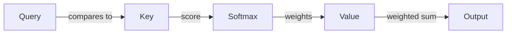

Query walked into the vault room with one question on her mind, and she didn't bother whispering it. "I need to know what's behind every door in this building — and I need to know it now."

The trouble was, Query couldn't open a single door herself. She didn't carry keys. She carried questions, and a question without a key is just noise. So she did the only thing that ever works in this line of work: she asked everyone in the room what they were holding.

That's where Key came in. Key didn't have the goods either — Key just held the labels. For every door, every box, every word in the room, Key had a tag that said, plainly, *here's what's behind me.* "Door one: a side conversation about the weather," Key said. "Door two: the actual instructions you're looking for. Door three: a decoy."

Query didn't trust any of them outright. Instead, she compared her question against every single label Key was holding, and scored how relevant each one sounded. Door two lit up high. Door one barely registered. Door three sat somewhere in between — close enough to be tempting, which was exactly the point of a decoy.

"You can't just take the highest score and walk," said a third voice from the back of the room. This was Value, and Value was the only one actually holding anything worth stealing. "Scores aren't shares. You need the room to agree on how to split this, or you'll just grab door two and miss the fact that doors one and three both had a little something useful buried in them too."

That's where the vault's lock came in — the part of the operation everyone just called Softmax. It took Query's raw scores, the messy, unscaled numbers she'd come up with by eyeballing Key's labels, and turned them into something disciplined: weights that summed to exactly one. Door two might get eighty percent of the weight. Door one, three percent. Door three, the decoy, maybe seventeen — enough to admit it wasn't nothing, not enough to fool anyone who'd done this before.

"Now we split," Value said, once the weights were locked in. Value's actual contents — the real goods behind every door — each got multiplied by their weight and added together. Eighty percent of door two's contents, seventeen percent of door three's, three percent of door one's, all blended into a single take that Query walked out with.

"That's it?" Query asked, the first time she ran the job. "We just... weight everything and add it up?"

"That's the whole heist," Key said. "Every word in the room does this, for every other word in the room, every single layer. You're not stealing one thing. You're building a version of yourself that's quietly aware of everything around you, weighted by how much it actually matters to the question you walked in with."

Query thought about that for a second, then shrugged and went back to work — because somewhere in the building, a thousand other rooms were running the exact same job, in parallel, all asking their own version of "what do I need right now," and all getting an answer built the same patient way: not by grabbing the loudest thing in the room, but by listening to everything and weighting accordingly.

The job had a weakness, though, and it showed up the first time the crew tried to scale. A small room with ten doors was nothing — Query compared her question against ten labels, Softmax locked in ten weights, Value blended ten contents, done. But the building kept growing. A hundred doors meant ten thousand comparisons, because Query had to check her question against every single label, and every other Query in the room was doing the same thing against the same set of doors. Double the doors, and the work didn't double. It quadrupled.

"This is the part nobody warns you about," Key said, watching the crew's compute budget climb. "You're not paying for the heist. You're paying for every possible pair of doors checking each other, all at once." That's the catch behind the elegance: self-attention scales beautifully with how much context it can use, and brutally with how much context it has to compare. Real crews handle this with tricks — only checking nearby doors, caching old comparisons, splitting the job across multiple smaller crews working in parallel instead of one crew checking everything against everything. But the core job never changes: compare what you need against what's labeled, lock in the weights, and take a blend instead of a single grab.

By the end of the night, Query, Key, and Value had run the job so many times it stopped feeling like a heist and started feeling like a routine — which, in a way, is exactly what it had become. Not a single dramatic theft, but millions of small, disciplined ones, stacked layer on layer, each one a little more aware of the room than the last.
