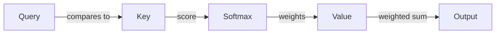

## Scene 1: The Job

Query walks into the vault room with one question on her mind: *what do I need right now?* She doesn't ask out loud — instead, she compares notes with everyone else in the room.

## Scene 2: The Negotiation

Key holds the labels. For every word in the room, Key whispers: *here's what I've got.* Query checks each Key against her own question, scoring how relevant it is.

## Scene 3: The Vault Opens

The scores go through Softmax — the vault's combination lock — turning raw scores into weights that sum to one. No score, no share.

## Scene 4: The Split

Value holds the actual goods. Each word's Value gets multiplied by its weight and summed up. The result: every word now carries a blend of the context it needed most.

## Scene 5: Walking Away

The heist crew repeats this for every word, every layer. That's self-attention — not magic, just a very well-organized split of attention across the room.
