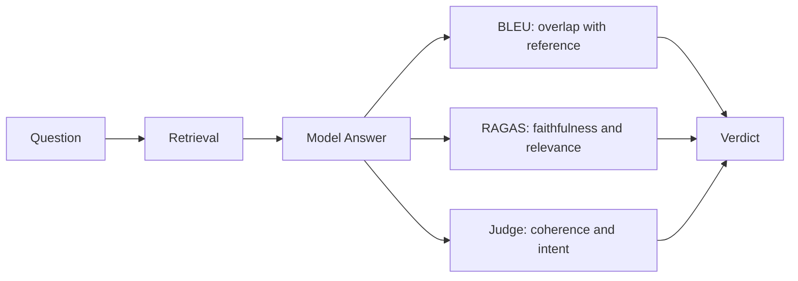

It is 9 in the morning in a quiet courtroom. The room is plain: a shared dashboard, a few open tabs, one model answer waiting for a verdict.

The case is specific. A user asked, "Did the new onboarding flow improve retention?" The model answered, "Yes, retention improved by 91%," and footnoted the claim to an internal report.

The question on trial today is simple to ask and hard to settle. Is that answer actually good?

*BLEU* is the veteran. He is literal and proud, and he measures one thing only: how many words and phrases in the answer overlap with an approved reference answer.

*RAGAS* is the investigator. She is skeptical and thorough, and she always pulls up the source documents to check whether the answer is truly grounded in them.

*Judge* is the newcomer, a language model asked to score other language models. He reads the whole exchange for tone and intent, and nobody in the room fully trusts him yet.

*BLEU* speaks first, spreading his counts across the table like exhibits.

"I have done this a thousand times. You give me the model answer, you give me the reference answer, and I count the overlap. Today's case: 91% overlap with the reference. Case closed."

"Overlap with which reference?" *RAGAS* asks from the back wall.

"You are comparing the answer to one approved version somebody wrote in advance. What if the model said something true in different words? You would fail it. What if it used the right words while inventing a fact? You would pass it."

*BLEU* pulls out his checklist of word and phrase overlap. It is fast, cheap, and completely blind to meaning. His 91% is real, but it answers a narrow question: do these words look like the reference?

*RAGAS* pulls up the retrieval step, the actual documents the model was handed before it answered. She checks three things, and she names each one out loud.

"Faithfulness. Did the answer stay true to the documents?"

"Relevance. Did it actually address the question?"

"Retrieval quality. Did we even fetch the right documents in the first place?"

She slides a printout across the table. The report the model cited says retention moved by 9%, not 91%. The model invented a digit.

"Faithfulness fails," *RAGAS* says. "The headline number appears nowhere in the source."

The room goes quiet. *BLEU* stares at his scorecard. 91% overlap, and still a fabricated fact sitting right in the middle of it.

*Judge* speaks up.

"May I weigh in? I read the whole exchange, not just keywords or citations. The answer is clear and well organized, and it addresses what the user meant. But *RAGAS* is right. One claim does not trace back to anything real. So the writing is strong and the citation is false. Those are not the same crime."

"You are a language model judging a language model," *BLEU* says. "Who checks your math?"

"Nobody, fully," *Judge* admits. "I am not ground truth. I am a fast second opinion, better than either of you at tone and intent, and worse than *RAGAS* at catching one fabricated number. None of us alone is the whole verdict."

The three of them work the same transcript from three angles for another hour. *BLEU* stays at 91%, accurate and silent on everything that matters. *RAGAS* finds a second invented detail, a date that matches no document. *Judge* keeps circling a softer worry: even setting the fabrication aside, the answer sounds more confident than the thin evidence deserves.

"So what do we tell the team?" *Judge* asks. "Pass or fail?"

"Neither, alone," *RAGAS* says.

Then the presiding Justice, who has watched every case in this court, finally speaks. Her ruling comes out like a verse.

"Trust no single number on its own,
For each one guards a different door:
One counts the words, one checks the source,
One weighs the meaning, nothing more.

Run them together, hear them all,
And let no metric stand alone,
The only verdict worth the name
Is built from every truth they have shown."

So that becomes the ruling. Not one score stamped on the model's forehead, but three findings the team can act on: a fabricated 91% to fix, a retrieval pipeline that was mostly working, and a tone that oversold the evidence.

Three specific problems instead of one confident, half blind number. Nobody in that courtroom claims to be the whole truth anymore.

## Terminology

**BLEU** — counts how many words and short phrases an answer shares with a reference answer.

**RAGAS** — checks whether an answer is faithful and relevant to the documents that were retrieved for it.

**LLM as Judge** — using a language model to score another model's output for qualities like coherence, tone, and intent.

**Faithfulness** — whether an answer stays true to its source material instead of inventing facts.

**Relevance** — whether an answer actually addresses the question that was asked.

**Retrieval** — the step that fetches source documents for the model to answer from.

**Ground Truth** — a verified correct answer that a metric can be trusted against.
