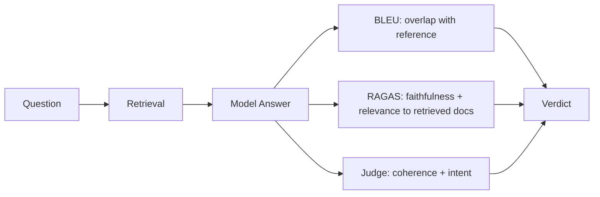

The courtroom didn't look like much — a shared dashboard, a few open tabs, a model's latest batch of outputs waiting for a verdict. But BLEU walked in like it owned the place, the way it always did. "I've done this a thousand times," BLEU said, spreading its n-gram counts across the table like exhibits. "You give me the model's answer, you give me a reference answer, I count how many words and phrases line up. Today's case: ninety-one percent overlap with the reference. Case closed."

"Overlap with what reference, though?" That was RAGAS, leaning against the back wall, unimpressed. "You're comparing the model's answer to one approved answer somebody wrote in advance. What if the model said something true and useful that just happens to use different words? You'd fail it. And what if it used the *exact* right words while making up a fact that was never in the source documents at all? You'd pass it. You don't even look at whether the answer is grounded in anything real."

BLEU bristled. "I measure what I measure. Nobody asked me to read minds."

"That's the problem," RAGAS said. "I actually pull up what was retrieved before the model answered — the documents it was supposed to be working from — and I check three things: did the answer stay faithful to those documents, was it actually relevant to the question, and did the retrieval step even fetch the right material in the first place. Your case file says ninety-one percent. Mine says the model invented a statistic that appears nowhere in the source it cited." RAGAS slid a printout across the table: a confident, fluent sentence, footnoted to a document that, on inspection, said nothing of the kind.

The room went quiet for a second. BLEU stared at the printout, then back at its own scorecard, the two pieces of paper telling completely different stories about the same answer.

That's when Judge spoke up — the newest voice in the room, and the one nobody fully trusted yet. "Can I weigh in? I read the whole exchange, not just keywords or citations. The user asked a nuanced, slightly ambiguous question. The model's answer was clear, well-organized, and addressed the intent even though it phrased things differently than your reference, BLEU. But RAGAS is right that one of its claims doesn't trace back to anything retrieved. So: good answer, bad citation. Those aren't the same crime, and they don't deserve the same sentence."

"You're an LLM judging an LLM," BLEU said, not quite an accusation, more a question. "Who checks your math?"

"Nobody, fully," Judge admitted. "I'm not a ground truth. I'm a second opinion — a fast, scalable one, better at catching tone, coherence, and intent than either of you, and worse at catching a single fabricated number buried in an otherwise solid paragraph. RAGAS catches that. You catch surface overlap with a reference that may or may not represent the only acceptable phrasing. None of us alone is the whole verdict."

The case dragged on for another hour, the three of them working the same transcript from three angles. BLEU's score stayed high, technically accurate to what it was built to measure and silent on everything else. RAGAS kept flagging the same fabricated statistic, plus a second, smaller one nobody had caught the first pass — a date that didn't match any retrieved document either. Judge, meanwhile, kept circling back to a softer concern: even setting the fabrication aside, the tone of the answer slightly oversold the model's confidence given how thin the underlying evidence actually was.

"So what do we tell the team?" Judge asked eventually. "Pass or fail?"

"Neither, by itself," RAGAS said. "Fail on faithfulness — there's a fabricated number that needs fixing before this ships. Pass on relevance and retrieval quality, the documents fetched were actually the right ones. That's not noise, that's three separate facts hiding inside one number if you only ran me."

"And I'll log that the writing quality and structure were strong," Judge added. "Useful context, even if it's not the headline."

BLEU exhaled, something between annoyance and relief. "Fine. My ninety-one percent isn't wrong, it's just answering a much narrower question than 'is this good.' I'll keep doing what I do. Just don't let anyone walk out of here holding only my number and calling it a verdict."

That became the actual ruling, in the end — not a single score stamped on the model's forehead, but a small panel of witnesses who each told the truth about a different part of the answer and refused to pretend their slice was the whole picture. The team that built the model didn't get the simple yes-or-no they'd hoped for walking in. They got something more useful: a fabricated statistic to fix, a citation pipeline that was mostly working, and a tone problem worth a second look — three specific, actionable findings instead of one confident, half-blind number. Nobody in that courtroom claimed to be the whole truth anymore. They'd learned, case by case, that the only verdict worth trusting was the one that came from all three of them refusing to shut up until they agreed on what had actually happened.
