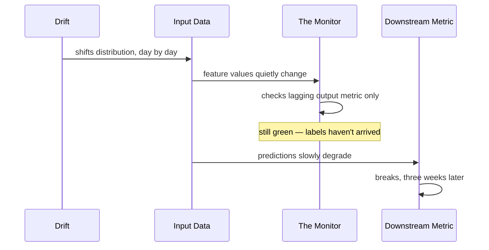

## Scene 1: The Quiet Entrance

Drift doesn't break down doors. Drift doesn't trip alarms. Drift comes in through the one entrance nobody locks: the input data, one feature at a time, one percentage point at a time.

Week one, a handful of new users sign up from a region the model has barely seen. Their session lengths run longer. Their click patterns lean toward categories the training set barely covered. None of it looks like an incident. It looks like Tuesday.

By the end of the week, the shift is still small enough to write off as noise — a rounding error in a histogram nobody's opened in months. That's the thing about Drift: it never needs a single dramatic entrance. It only needs to be slightly more present than it was yesterday, for long enough that "slightly" stops being the right word.

## Scene 2: The Sleeping Guard

The Monitor is technically on duty. The Monitor watches one thing: did the model's accuracy on yesterday's labeled data drop? It hasn't — because yesterday's labels haven't arrived yet. Ground truth for this system takes two weeks to settle, since it depends on what users do after the model's recommendation, not just the recommendation itself.

So every morning, The Monitor checks a number that is, structurally, always stale. It compares today's predictions against labels from two weeks ago — a version of the world where Drift hadn't shown up yet. Of course it comes back clean. It's not wrong, exactly. It's just answering a question about the past while Drift keeps working in the present.

The Monitor isn't lazy. The Monitor is watching the only thing it was ever told to watch, and that thing has a two-week blind spot built into it by design.

## Scene 3: The Numbers Nobody Reads

The Dashboard is doing its job, technically. Every morning it posts the same five charts: requests per second, latency, error rate, model accuracy, uptime. All green. All correct, in the narrow sense that none of those five numbers has moved outside its usual band.

What the Dashboard doesn't show: the average value of three input features has crept up 15% since Drift walked in during week one. Nobody built that chart, because three weeks ago nobody thought they'd need it. The Dashboard was designed to answer "is the system broken right now," and by every measure it has, the system isn't. It was never designed to answer "is the world the model was trained on still the world it's operating in" — a quieter, slower question that doesn't show up as a spike.

Week two passes the same way week one did. The five charts stay green. Underneath them, the input distribution keeps walking further from where the model was trained, one day's worth of users at a time.

## Scene 4: The Crash

In week three, a downstream metric — conversion rate on recommended items — falls off a cliff. Not gradually. It just drops, because the model has finally been making confidently wrong predictions on a population it was never trained on, for long enough that the damage compounds into something visible all at once. The model didn't get worse overnight. The mismatch between what it learned and what it's now seeing finally crossed a threshold where its confidence stopped matching its accuracy.

The on-call engineer pulls up the Dashboard. Green. Green. Green. Green. Red. One signal, after three weeks of silence, finally loud enough to act on — and by now it's a fire, not a warning.

## Scene 5: Tracing It Back

The team starts where the break is and works backward — not forward from a cause, because they don't have one yet. They pull up conversion rate by user segment and notice it's not falling uniformly; it's collapsing hardest in exactly the segment that grew fastest over the last three weeks. That's the thread they follow.

They diff this week's input feature distributions against the training distribution from three months ago. The shift Drift caused in week one is sitting right there, small and patient, exactly where nobody was looking: a 15% creep in three features, visible in retrospect, invisible in real time because nothing was watching for it.

## Scene 6: What Changes Next

The fix isn't a bigger model or a faster retrain cadence. It's a chart that didn't exist before: input feature distributions, tracked continuously against a rolling baseline, alerting on shift — not just waiting for the damage to show up downstream, two weeks late, after a metric finally breaks.

The Monitor gets a second job. Instead of only checking lagging accuracy against stale labels, it now watches the thing it could have watched all along: whether today's inputs still look like the inputs the model was trained on. Drift doesn't need to be stopped at the door. It needs to be visible the moment it walks in — not three weeks, and one crashed metric, later.
