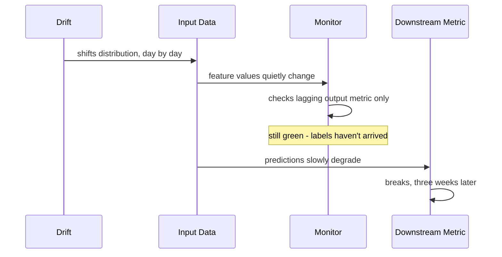

Drift doesn't break down doors. Drift doesn't trip alarms. Drift comes in through the one entrance nobody locks: the input data, one feature at a time, one percentage point at a time.

In week one, a handful of new users sign up from a region the model has barely seen. Their session lengths run longer. Their click patterns lean toward categories the training set barely covered. "Nothing dramatic," Drift would say, if Drift bothered to announce itself, which it never does. "Just Tuesday." By the end of the week the shift is still small enough to write off as noise — a rounding error in a histogram nobody's opened in months. That's the whole strategy: never be dramatic, only be slightly more present than yesterday, for long enough that "slightly" stops being the right word.

Monitor is technically on duty the entire time. Ask Monitor how things are going and you'll get a confident answer: "Accuracy's fine. Checked it this morning." What Monitor doesn't mention, unless you push, is what "this morning's check" actually compares — today's predictions against labels from two weeks ago, because ground truth here takes that long to settle. It depends on what users do after the model's recommendation, not just the recommendation itself. So every morning, Monitor is answering a question about a version of the world where Drift hadn't shown up yet. "I'm not lying to you," Monitor would say. "I'm just telling you about two weeks ago and calling it now."

Status, meanwhile, is doing exactly what it was built to do. Every morning it posts the same five numbers: requests per second, latency, error rate, model accuracy, uptime. All green. "Don't blame me," Status would say, if anyone thought to ask it directly. "Nobody told me to watch the input features. I watch what I was told to watch, and what I was told to watch hasn't moved." That's true, and it's also the whole problem — the average value of three input features has crept up fifteen percent since Drift walked in, and there's no chart for that, because three weeks ago nobody thought they'd need one.

Week two passes the same way week one did. Status stays green. Monitor stays confident. Underneath both of them, the input distribution keeps walking further from where the model was trained, one day's worth of users at a time, with nobody in the room contradicting either of them, because neither one is technically wrong.

Then week three arrives, and a downstream metric — conversion rate on recommended items — falls off a cliff. Not gradually. It just drops, because the model has finally been making confidently wrong predictions on a population it was never trained on, for long enough that the damage compounds into something visible all at once. The model didn't get worse overnight. The mismatch between what it learned and what it's now seeing finally crossed a threshold where its confidence stopped matching its accuracy.

The on-call engineer pulls up Status. Green. Green. Green. Green. Red. "Wait," the engineer says, "you've been green this whole time?" "I have," Status says. "Still am, mostly." One signal, after three weeks of silence, finally loud enough to act on — and by now it's a fire, not a warning.

The team starts where the break is and works backward, since they don't have a cause yet, only a wound. They pull conversion rate apart by user segment and notice it isn't falling uniformly — it's collapsing hardest in exactly the segment that grew fastest over the last three weeks. That's the thread they follow. They diff this week's input feature distributions against the training distribution from three months back, and there it is: the fifteen percent creep Drift caused in week one, sitting right where nobody was looking, visible in retrospect and invisible the entire time it mattered.

"You could have told us," the engineer says to Monitor, half a question and half an accusation. "I told you exactly what you asked me to track," Monitor says. "You asked about outcomes two weeks old. You never asked about inputs from this morning."

That's the fix, in the end — not a bigger model, not a faster retrain cadence, but a question nobody had been asking. Monitor gets a second job: instead of only checking lagging accuracy against stale labels, it now watches whether today's inputs still look like the inputs the model was trained on, continuously, against a rolling baseline. Drift doesn't need to be stopped at the door. It needs to be visible the moment it walks in — not three weeks, and one crashed metric, later.
